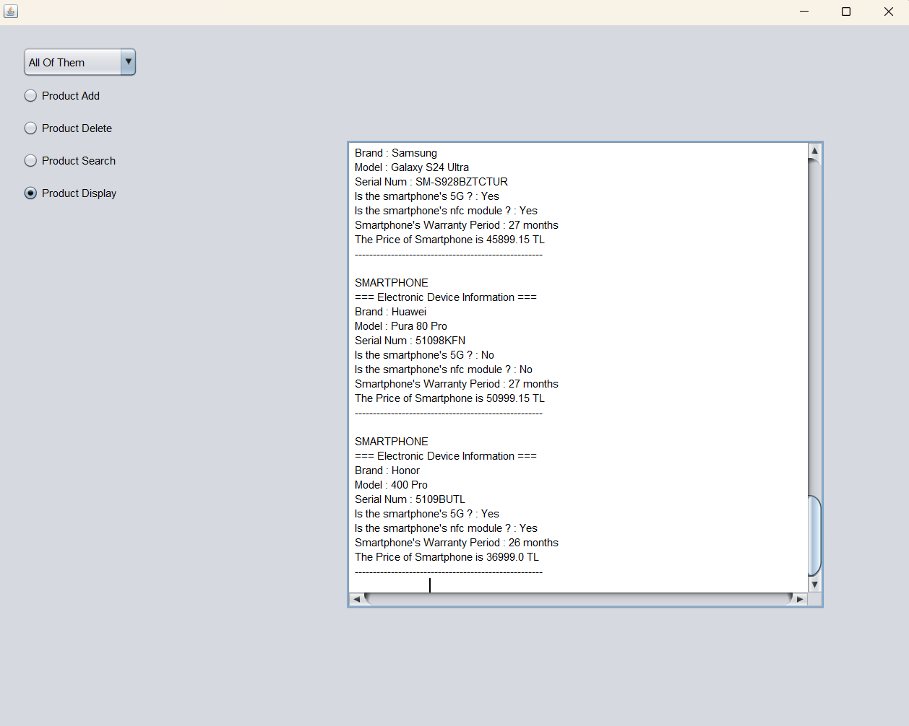
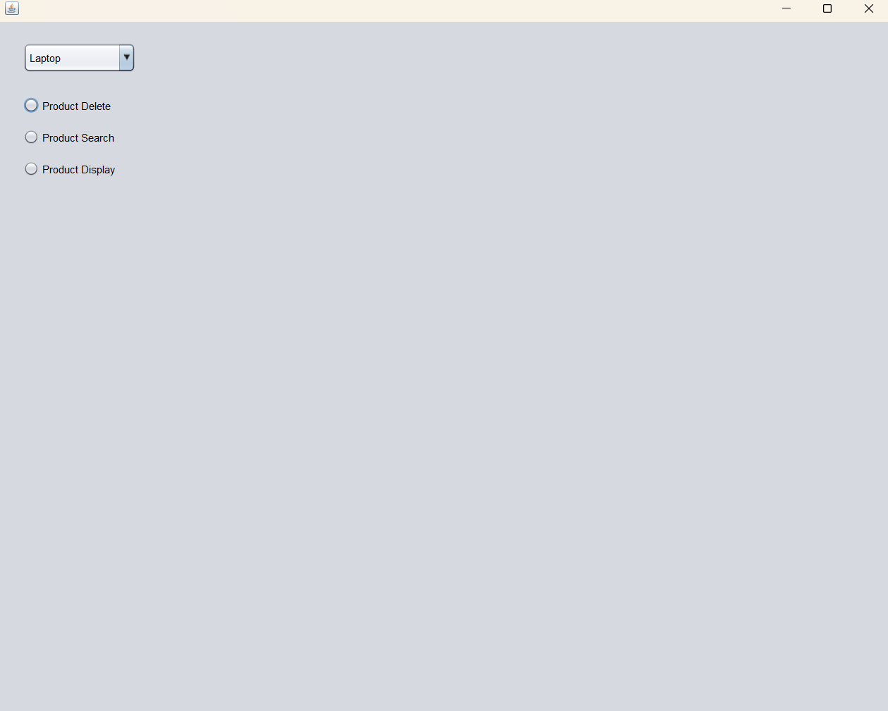

# TECHSTORE PRODUCT MANAGEMENT SYSTEM

## 📖Project Description
TechStore Product Management System is a desktop application developed to help electronics stores manage their inventory efficiently. 
The main goal of this project is to give full control to the users. Instead of just viewing a static list, the store staff can actively manage the stock by adding new items and removing sold products.

The system is built using **Java** and the **Swing** library for the graphical user interface. It organizes electronic devices into three main categories: **Laptops**, **Smartphones**, and **Tablets**.

To ensure security, the application uses a login system with two different access levels:
* **Manager:** Has full authority. A manager can add new products, delete existing ones, search for specific items, and display the entire inventory.
* **Staff:** Has limited access focused on sales. A staff member can delete sold products, search for items, and display the inventory, but cannot add new stock.

## 🛠 Technical Implementation
This project is built using **Java** and strictly follows **Object-Oriented Programming (OOP)** principles. Below are the key technical details:

### 1. Inheritance Hierarchy
The project relies on a robust **Inheritance** structure to ensure **Code Reusability** and maintainability.

**Abstract Superclass: `ElectronicDevice`**
* **Abstraction:** This class serves as the **abstract blueprint** for all items and cannot be instantiated directly.
* **Encapsulation:** It encapsulates common `protected` attributes shared by all devices: `brand`, `model`, `serialNum`, and `price`.
* **Polymorphism:** It defines the abstract method `calculatePrice()`. This enforces **Method Overriding**, compelling each subclass to implement its own unique pricing logic.

**Concrete Subclasses (Specialization)**
We extended the superclass into three **Concrete Classes**, each adding specific features:

* **Laptop:** Extends the structure with hardware specifications like `ramSize`, `cpu`, and `ssd`.
* **Tablet:** Specializes the device by adding a `screenSize` attribute for display dimensions.
* **SmartPhone:** Includes a specific `is5G` attribute to track network connectivity support.

### 2. Composition (Has-a Relationship)
To adhere to advanced OOP standards, we implemented **Composition** instead of relying solely on inheritance. 
Each device class contains a specific component object from the `techstore.components` package to handle specialized operations.

* **Laptop & FanCount:** The `Laptop` class has a `FanCount` object.
  This component uses the `numberFanCount()` method to determine the cooling requirements based on the brand.
* **Tablet & Pencil:** The `Tablet` class includes a `Pencil` object.
  This component manages stylus features, checking for nib changeability via `isChangeablePencilNib()` and storing the specific `pencilType` (e.g., Apple Pencil, S Pen).
* **SmartPhone & NfcModule:** The `SmartPhone` class utilizes an `NfcModule` object.
  This component validates the presence of Near Field Communication technology using the `hasNfcModule()` method.

### 3. Interfaces
To manage business logic and ensure modularity, we implemented two key interfaces in the `techstore.interfaces` package.

* **Warranty:** This interface defines standard warranty constants (e.g., 36 months for Laptops, 12 months for Tablets).
  It enforces the implementation of the `warrantyPeriod()` method, allowing each device to calculate its specific warranty duration based on these standards.
* **CampaignApplicable:** This interface facilitates marketing logic. It includes the `applyDisCount(String brand)` method, which determines whether a specific brand is eligible for a price reduction.

### 4. Core System Architecture & Algorithms
The `SystemClass` serves as the central engine (Controller) of the application, managing the entire lifecycle of the inventory. It handles data storage, stock tracking, and complex algorithmic operations without relying on external databases.

 **4.1. Dynamic Data Management (Polymorphism)**
* **Storage Mechanism:** We utilize a single dynamic `ArrayList` to store all inventory items.
* **Polymorphic Design:** Thanks to inheritance, this list can hold `Laptop`, `Tablet`, and `SmartPhone` objects simultaneously, treating them as generic `ElectronicDevice` objects while preserving their specific behaviors.

 **4.2. Smart Stock Tracking**
The system implements a real-time tracking mechanism using `static` variables to maintain stock counts globally across the application.
* **Type-Safe Updates:** The `updateStock` method automatically detects the device type using the `instanceof` operator. It then updates the specific counter (`stockAmount_L`, `stockAmount_T`, or `stockAmount_S`) accordingly.
* **Validation Logic:** The system includes safety checks to prevent data corruption. For example, it prevents the stock count from dropping below zero if a user tries to delete a non-existent item.

 **4.3. Categorized Insertion Strategy (Sorted Logic)**
Unlike standard addition methods that simply append items to the end of a list, our `addDeviceForManager` method employs a **Categorized Insertion Algorithm**.
* **Logic:** When a manager adds a new device, the system calculates the correct index based on the device type.
    * **Laptops** are inserted at the top.
    * **Tablets** are inserted after laptops.
    * **Smartphones** are appended at the end.
* **Benefit:** This ensures the inventory list remains organized by category automatically, without needing a separate sorting algorithm.

 **4.4. Recursive Algorithms**
To demonstrate advanced algorithmic proficiency, we replaced standard iterative loops with **Recursive Methods** for key operations:
* **Recursive Search (`searchRecursive`):** Searches the list index-by-index to find a product by its unique serial number. If found, it returns the object; otherwise, it calls itself for the next index.
* **Recursive Delete (`deleteRecursive`):** Locates a product by serial number recursively, removes it from the list, and triggers the stock update method to decrease the count.
* **Recursive Display (`displayRecursive`):** Traverses the entire list recursively to build a formatted string representation of the inventory.
  
### 5. Graphical User Interface (GUI)🖥️ 
We developed the user interface using the **Java Swing** library. The application is designed with a multi-frame architecture to separate user roles and functionalities effectively.

**5.1. Multi-Frame Navigation**

* **Secure Access:** The system begins with a secure login interface to verify credentials.

* **Role-Based Routing:** Users are automatically redirected to either the ManagerFrame or PersonalFrame based on their authorization level (Manager or Staff), ensuring task-specific environments.

**5.2. Category-Based Filtering (JComboBox)**

* **Dynamic Categorization:** Utilizing a JComboBox, users can effortlessly switch between hardware categories: Laptops, Tablets, and Smartphones.

* **Comprehensive Overview:** The "All Of Them" selection triggers the recursive display algorithm to present the entire inventory in a single view.

**5.3. Interactive Operation Flow (JRadioButtons)**

* **Adaptive UI:** To maintain a clutter-free workspace, the system uses dynamic visibility logic. Input fields, such as SerialText, and instruction labels remain hidden by default.

* **Task-Specific Activation:** Relevant components and action-oriented labels only become visible once a specific operation (Add, Search, or Delete) is activated via the JRadioButtons.

**5.4. Real-Time Data Display**

* **Formatted Output:** Inventory data is rendered in a clean, formatted string format within a JTextArea.

* **Navigational Ease:** The output area is integrated with a JScrollPane, enabling vertical and horizontal navigation for large datasets, ensuring no information is cut off.

**5.5. Consistent Design & UX**

* **Fixed Dimensions:** The application window is set to a fixed size to prevent layout distortion and ensure a uniform experience on different screens.

* **Auto-Centering:** The frames are programmed to initialize at the center of the user's monitor, providing a professional look and feel from the first launch.
